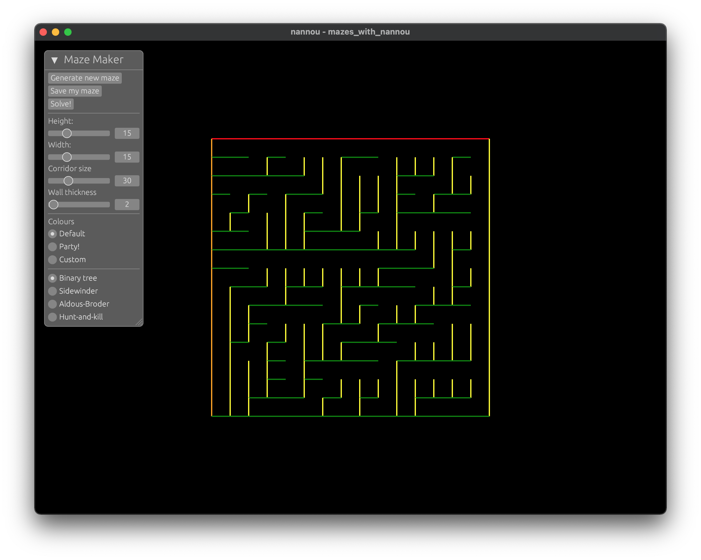

# Displaying Mazes with Nannou
This repo combines my maze-making [code](https://github.com/joaoag/mazes) with creative coding framework [Nannou](https://nannou.cc/).  
It's my first Rust project so things are pretty rough and ready!

## Running locally
Make sure you have Rust lang installed (instructions [here](https://www.rust-lang.org/tools/install))  
I've only used this on macOS, so if you're using something else your mileage may vary.

Steps for running locally:
1. Clone or fork this repo (see GitHub docs [here](https://docs.github.com/en/desktop/contributing-and-collaborating-using-github-desktop/adding-and-cloning-repositories/cloning-and-forking-repositories-from-github-desktop) for help)
2. Navigate to the repo in your terminal
3. Run `cargo run`
4. You should then see something like the below:

### User guide

| Button                                            | Behaviour                                                                                                        |
|---------------------------------------------------|------------------------------------------------------------------------------------------------------------------|
| `Generate new maze`                               | creates a maze, using the current settings from the UI                                                           |
| `Save my maze`                                    | exports a png of the generated maze to a `mazes_with_nannou` sub-directory in the project                        |
| `Solve!`                                          | increases blue intensity the further a route extends from the top left cell, illustrating paths through the maze |
| `Height`                                          | sets the number of walls on the vertical axis                                                                    |
| `Width`                                           | sets the number of walls on the horizontal axis                                                                  |
| `Corrider size`                                   | sets the size of the empty space between the walls                                                               |
| `Wall thickness`                                  | sets the width of the walls                                                                                      |
| `Colours`                                         | options for colouring the maze walls, selecting 'Custom' opens a colour picker for each wall (ish)               |
| `Binary tree`, `Sidewinder`, `Aldous-Broder` etc. | different maze-making algorithms                                                                                 |

## To Do
* Implement Hunt-and-Kill and Recursive Backtracker algorithms
* Add:
  * other maze-making algorithms
  * wall thickness controls
  * wall colour controls
* Pixel display for maze solver
* Restructure project to make it more idiomatic, misc. code tidying e.g. removing unused code
* Allow `cli_display()` to be triggered from the command line, update docs accordingly
* Address bugs that happen when width is set to more than one greater value than height